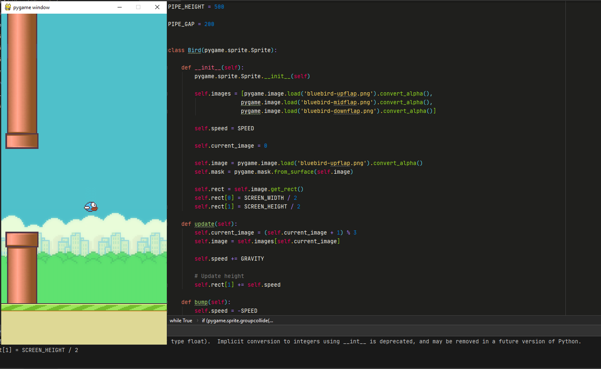

# flappy_bird
Code this game using Python and Pygame framework, it is a great exercise to study Python.

This is not one full version of the game, I did this with the intention of learning more and solve problems to make this game works. In my opinion, this is a good exercise.

I hope son make one tutorial step by step of this game in my blog:

fl4.dev 

Thank for reading.

